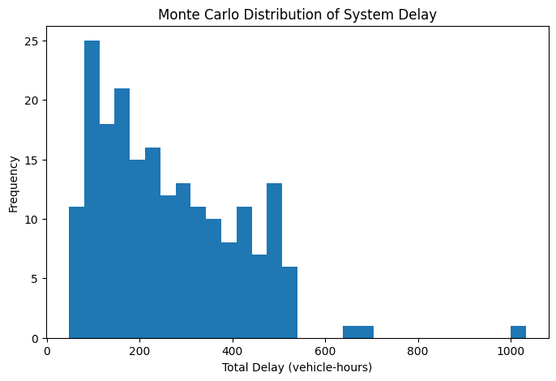

# Huntsville_Traffic_Model

# Urban Traffic Flow & Resilience Model (Huntsville Case Study)

## Overview
This project develops a network-based traffic simulation model to analyze congestion propagation, system resilience, and infrastructure vulnerability in Huntsville, Alabama.

The model evaluates how disruptions, demand variability, and time-of-day patterns impact system performance, with a focus on identifying critical bottlenecks and effective mitigation strategies.

---

## Key Results

- Disruption of a critical corridor increased total system delay by **+1851%**
- Monte Carlo simulation revealed a **low-frequency, high-impact failure system (~6% probability)**
- Targeted improvements to alternate corridors restored system performance to baseline levels
- AM peak produced the highest congestion due to concentrated inbound commuter demand

---

## Methodology

- Graph-based traffic network (nodes = zones, edges = corridors)
- Shortest-path traffic assignment with iterative updates
- Nonlinear congestion modeling using volume-delay (BPR) functions
- Monte Carlo simulation with stochastic demand and incident scenarios
- Time-of-day demand modeling (AM Peak, PM Peak, Midday, Night)

---

## Visualizations

### Baseline Network

### Incident Scenario

### Monte Carlo Delay Distribution

### Time-of-Day Analysis

---

## Tools & Technologies

- Python
- NumPy, Pandas
- NetworkX
- Matplotlib
- Monte Carlo Simulation

---

## Report

Full report available here:

📄 [Traffic Flow & Resilience Report](HSV%20Traffic%20Model%20Report.pdf)

---

## Author

Tyler "Slade" Gilmer  
M.S. Industrial & Systems Engineering – UAH  
